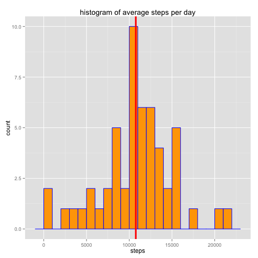

This report looks at some activity monitoring data collected at 5 minute interval  
througout the day for an anonymous individual during the months of October and November 2012.

#### Loading and preprocessing the data

```r
setwd('~/Documents/RepData_PeerAssessment1/')
activity <- read.table(unz('activity.zip', 'activity.csv'), 
                       header = TRUE, sep = ",")
library(lubridate)
activity$date <- ymd(activity$date)
str(activity)
```

```
## 'data.frame':	17568 obs. of  3 variables:
##  $ steps   : int  NA NA NA NA NA NA NA NA NA NA ...
##  $ date    : POSIXct, format: "2012-10-01" "2012-10-01" ...
##  $ interval: int  0 5 10 15 20 25 30 35 40 45 ...
```

#### What is the mean total number of steps taken per day

```r
library(dplyr)
stepsByDay <- group_by(activity, date) %>% 
    summarise(sum(steps))
names(stepsByDay) <- c("date", "totalSteps")
meanSteps <- mean(stepsByDay$totalSteps, na.rm = TRUE)
medianSteps <- median(stepsByDay$totalSteps, na.rm = TRUE)
library(ggplot2)
ggplot(stepsByDay, aes(totalSteps)) + 
    geom_histogram(col = "blue", fill = "orange", binwidth = 1000) + 
    geom_vline(data = stepsByDay, aes(xintercept = meanSteps), 
               col = "red", size = 1.5) +
    labs(title = "histogram of average steps per day", x = "steps")
```

 

```r
summaryActivity <- summary(activity$steps)
```

The mean and median steps taken per day is 

```
## [1] 10766.19
```
and

```
## [1] 10765
```
respectively.

#### What is the average daily activity pattern?

```r
by_interval <- group_by(activity, interval) %>% 
    summarise(mean(steps, na.rm = TRUE))
names(by_interval) <- c("interval", "meanSteps")
maxMeanSteps <- by_interval[which.max(by_interval$meanSteps), ]
ggplot(by_interval, aes(interval, meanSteps)) + 
    geom_line(col = "blue") + 
    geom_point(alpha = .5, col = "red") +
    geom_text(data = maxMeanSteps, 
              aes(label = paste("highest at", round(interval, 1), ",", 
                                round(meanSteps, 1))), 
              size = 5, col = "purple") + 
    geom_smooth(method = "lm", col = "orange") +
    geom_hline(aes(yintercept = mean(activity$steps, na.rm = TRUE)), 
               col = "lightblue") + 
    geom_point(data = maxMeanSteps, aes(interval, meanSteps), 
               alpha = .4, size = 8, col = "orange") +
    labs(title = "average steps per 5 min interval", 
         y = "mean steps", x = "5 min intervals")
```

 

The interval with the highest mean steps of **206.1698113** is at **835**

#### Imputing missing values

```r
missingValues <- sum(!complete.cases(activity))
```
The data contains **2304** missing values

A simple approach to imputating missing values is adopted where missing steps are  
simply replaced by the mean steps without any grouping calculated below **37.3825996**


```r
activity$steps[is.na(activity$steps)] = mean(activity$steps, na.rm = TRUE)
stepsByDay_imputed <- group_by(activity, date) %>% 
    summarise(sum(steps))
names(stepsByDay_imputed) <- c("date", "totalSteps")
meanStepsImputed <- mean(stepsByDay_imputed$totalSteps)
medianStepsImputed <- median(stepsByDay_imputed$totalSteps)
ggplot(stepsByDay_imputed, aes(totalSteps)) + 
    geom_histogram(col = "blue", fill = "orange", binwidth = 1000) + 
    geom_vline(data = stepsByDay_imputed, aes(xintercept = meanStepsImputed), 
               col = "red", size = 1.5) +
    labs(title = "average steps per day", x = "steps")
```

 

The difference in mean steps and median steps of the imputed data and the orignal are now **0** and **1.1886792** respectively.  
These two statistics essentially remained the same before and after imputation, but it is clear from  
the following boxplot, that imputation has decreased the interquartile range.


```r
boxplot(summaryActivity, summary(activity$steps))
```

 

#### Are there differences in activity patterns between weekdays and weekends?

```r
library(chron)
activity$weekend <- is.weekend(activity$date)
activity$day <- "weekday"
activity$day[activity$weekend == T] <- "weekend"
by_day <- group_by(activity, interval, day) %>% 
    summarise(mean(steps, na.rm = TRUE))
names(by_day) <- c("interval", "day", "meanSteps")
maxMeanSteps <- by_day[which.max(by_day$meanSteps), ]
ggplot(by_day, aes(interval, meanSteps)) + 
    geom_line(col = "blue") + 
    geom_point(alpha = .5, col = "red") +
    geom_smooth(method = "lm", col = "orange") +
    facet_grid(. ~ day) +
    labs(title = "average steps per 5 min interval", 
         y = "mean steps", x = "5 min intervals")
```

 

Lets look at the summary next.

```r
weekend <- filter(activity, day == "weekend") %>%
    group_by(date) %>% summarise(sum(steps))
names(weekend) <- c("date", "totalSteps")
weekday <- filter(activity, day == "weekday") %>%
    group_by(date) %>% summarise(sum(steps))
names(weekday) <- c("date", "totalSteps")
summary(weekend$totalSteps)
```

```
##    Min. 1st Qu.  Median    Mean 3rd Qu.    Max. 
##    8821   10720   11650   12200   14370   15420
```

```r
summary(weekday$totalSteps)
```

```
##    Min. 1st Qu.  Median    Mean 3rd Qu.    Max. 
##      41    8355   10760   10260   12790   21190
```

So it does seem like there is some distinction between weekend and weekday mean steps - ***1.2201524 &times; 10<sup>4</sup>*** for weekend vs ***1.0255847 &times; 10<sup>4</sup>*** for weekdays. 

#### Conclusion
Lets validate what we saw above using a two sided t-test next using unequal variance.


```r
t.test.result <- t.test(weekend$totalSteps, weekday$totalSteps)
```

```
## 
## 	Welch Two Sample t-test
## 
## data:  weekend$totalSteps and weekday$totalSteps
## t = 2.3349, df = 53.738, p-value = 0.02331
## alternative hypothesis: true difference in means is not equal to 0
## 95 percent confidence interval:
##   274.8332 3616.5192
## sample estimates:
## mean of x mean of y 
##  12201.52  10255.85
```

Given that the 95% confidence interval of the differences between the two subsets is **274.8332192, 3616.5191917** (so doesn't include 0) and  
the t-statistic is **2.3349186** which is much higher than the 95% confidence t-statistic for a **53.7375511** degrees of freedom of around  
**2.0051036** and the associated p-value of the t test is **0.0233137** (assuming alpha at 5%), we can statistically conclude that the individual walked on  
average more on the weekends than weekdays.
